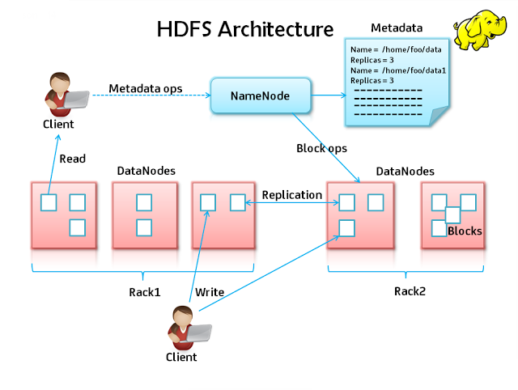

In order to use HADOOP, it is crucial that you understand the basic functioning of HDFS, as well as some of its constraints.
After a brief introduction of core HDFS concepts, this page presents _copy-paste_-like tutorial to familiarize with
[HDFS commands](http://hadoop.apache.org/docs/current/hadoop-project-dist/hadoop-hdfs/HDFSCommands.html){:target="_blank"}.
It mainly focuses on user commands (uploading and downloading data into HDFS).

## Resources

While the source of truth for HDFS commands is the code source, the [documentation page describing the `hdfs dfs` commands](http://hadoop.apache.org/docs/current/hadoop-project-dist/hadoop-common/FileSystemShell.html){:target="_blank"} is really useful.

A good and simpler cheat sheet is also available [here](http://www.dummies.com/how-to/content/hadoop-for-dummies-cheat-sheet.html){:target="_blank"}.

## Introduction

HDFS (_Hadoop Distributed File System_) is one of the core components of HADOOP.

The HDFS is a distributed file system designed to run on commodity hardware. Very powerful,
it should ensure that data are replicated across a wide variety of nodes, making the system
fault tolerant and suitable for large data sets and gives high throughput.

!!! Tip
    To have a better understanding of how HDFS works, we strongly encourage you to check out [the HDFS Architecture Guide](https://hadoop.apache.org/docs/r1.2.1/hdfs_design.html){:target="_blank"}.


### Some remarks on HDFS

HDFS uses a __simple coherency model__: applications mostly need a _write-once-read-many_ access model for files. As a result, a file once created, written to and closed becomes read-only. It is possible to append to an HDFS file only if the system was explicitly configured to.

HDFS is tuned to deal with __large files__. A typical file in HDFS is gigabytes to terabytes in size. As a result, try to avoid scattering your data in numerous small files.

HDFS is designed more for __batch processing__ rather than interactive use (high throughput versus low latency), and provides only sequential access of data. If your application has other needs, check out tools like _HBase_, _Hive_, _Apache Spark_, etc.

> “Moving Computation is Cheaper than Moving Data”

### HDFS architecture

As the [the HDFS Architecture Guide](https://hadoop.apache.org/docs/r1.2.1/hdfs_design.html){:target="_blank"} explains, HDFS has a __master/slave architecture__.

An HDFS cluster consists of a single __NameNode__, a master server that manages the file system namespace and regulates access to files by clients. In addition, there are a number of __DataNodes__, usually one per node in the cluster, which manage storage attached to the nodes that they run on. HDFS exposes a file system namespace and allows user data to be stored in files. Internally, a file is split into one or more blocks and these blocks are stored in a set of DataNodes. The NameNode executes file system namespace operations like opening, closing, and renaming files and directories. It also determines the mapping of blocks to DataNodes. The DataNodes are responsible for serving read and write requests from the file system’s clients. The DataNodes also perform block creation, deletion, and replication upon instruction from the NameNode.




------------------------------

## Basic Manipulations

To interact with HDFS you should use the __dfs__ module.
The dfs module, also known as "FS shell", provides basic file manipulation operations.

!!! Info
    In HDFS, user's folders are stored in `/user` and not `/home` like traditional Unix/Linux filesystems.

### Listing your home folder

```shell
 $ hdfs dfs -ls /user/<your_user>
 Found 28 items
 ...
 -rw-r--r--   3 llinder  daplab_users   6398990 2015-03-13 11:01 data.csv
 ...
 ^^^^^^^^^^   ^ ^^^^^^^^ ^^^^^^^^^^^^   ^^^^^^^ ^^^^^^^^^^ ^^^^^ ^^^^^^^^
          1   2        3            4         5          6     7        8
```

!!! Info
    Relative paths points to your home folder, using : `hdfs dfs -ls /user/<your_user>` is the same as `hdfs dfs -ls`

Columns, as numbered below, represent:

1. Permissions, in [traditional unix permission](http://en.wikipedia.org/wiki/File_system_permissions#Notation_of_traditional_Unix_permissions unix-style){: target="_blank"} syntax;
2. Replication factor, _RF_ in short. The RF default to 3 for a file and 0 for a directory; 
3. Owner (you!);
4. Group owning the file;
5. Size of the file, in bytes. Note that to compute the physical space used, this number should be multiplied by the RF;
6. Modification date. As HDFS being mostly a ''[write-once-read-many](http://en.wikipedia.org/wiki/Write_once_read_many){:target="_blank"}'' filesystem,
this date often means creation date;
7. Modification time. Same as date;
8. Filename, within the listed folder.


### Uploading a resource

To put a file to HDFS, you have two choices. You can use `hdfs` with the `-put` option or with the `-copyFromLocal` option:

```shell
# uploading a file
hdfs dfs -put localfile.txt /user/<your_user>
hdfs dfs -copyFromLocal localfile.txt /user/<your_user>
# uploading a directory 
hdfs dfs -put localdir /user/<your_user>
hdfs dfs -copyFromLocal localdir /user/<your_user>
```

The first arguments after `-copyFromLocal` or `-put` point to local files or folders, while the last argument is a file (if only one file listed as source) or directory in HDFS. Note that you can rename files and folders when copying, exactly as you would do in a linux shell:

```shell
# uploading all files in the current directory with the .txt extension
hdfs dfs -put *.txt /user/<your_user>
hdfs dfs -copyFromLocal *.txt /user/<your_user>
# uploading a directory and renaming it hdfsdir
hdfs dfs -put localdir /user/<your_user>/hdfsdir
hdfs dfs -copyFromLocal localdir /user/<your_user>/hdfsdir
```
### Uploading data for next sessions:

* Now lets upload the data that we will use for MapReduce and Hive:

1) Bible Shakespear Data:

* Download [bible_shakespear](resources/bible_shakes.nopunc.gz){: target="_blank"} data set
* Decompress and upload to HDFS:

```shell
hdfs dfs -put bible_shakes.nopunc /user/<your_user>
```
2) Batting Data:

* Download the csv file [Batting.csv](resources/Batting.csv){: target="_blank"}
* Upload to HDFS:

```shell
hdfs dfs -put Batting.csv /user/<your_user>
```

### Downloading a resource

Download is the same as uploading, but `-put` becomes `-get` and `-copyFromLocal` becomes `-copyToLocal`:

```shell
hdfs dfs -get /user/<your_user>/remotefile.txt .
hdfs dfs -copyToLocal /user/<your_user>/remotefile.txt .
```

### Creating a folder

To create a folder, use `-mkdir`

```shell
# create a folder in your hdfs home
hdfs dfs -mkdir dummy-folder
```


### Removing resources

To remove individual files, use the `-rm` option:

```shell
hdfs dfs -rm /user/<your_user>/somefile.txt
```

To remove a folder, the option is `-rmdir` for an empty directory and `-rm -r` for a non-empty one. The `-r` in `-rm -r` means _recursive_: it removes the folder and all its children recursively:

```shell
# remove the dummy-folder in your home
hdfs dfs -rmdir dummy-folder
rmdir: '/tmp/lala': Directory is not empty
# oups, the directory is not empty... use -rm -r
hdfs dfs -rm -r dummy-folder
```


## Advanced Manipulations

the `hdfs dfs` command support several actions that any linux user is already familiar with. Most of their parameters are the same, but note that the collapsing of options (`-rf` instead of `-r -f` for example) are not supported. Here is a non-exhaustive list:

- `-rm [-r] [-f]`: remove a file or directory;
- `-cp [-r]`: copy a file or directory;
- `-mv`: move/rename a file or directory;
- `-cat`: display the content of a file;
- `-chmod`: manipulate file permissions;
- `-chown`: manipulate file ownership;
- `-tail|-touch|`etc.

Other useful commands include:

- `-moveFromLocal|-moveToLocal`: same as `-copyFromLocal|-copyToLocal`, but remove the source;
- `-stat`: display information about the specified path;
- `-count`: counts the number of directories, files, and bytes under the paths;
- `-du`: display the size of the specified file, or the sizes of files and directories that are contained in the specified directory;
- `-dus`: display a summary of the file sizes;
- `-getmerge`: concatenate the files in src and writes the result to the specified local destination file. To add a newline character at the end of each file, specify the `addnl` option: `hdfs dfs -getmerge <src> <localdst> [addnl]`
- `-setrep [-R]`: change the replication factor for a specified file or directory;
