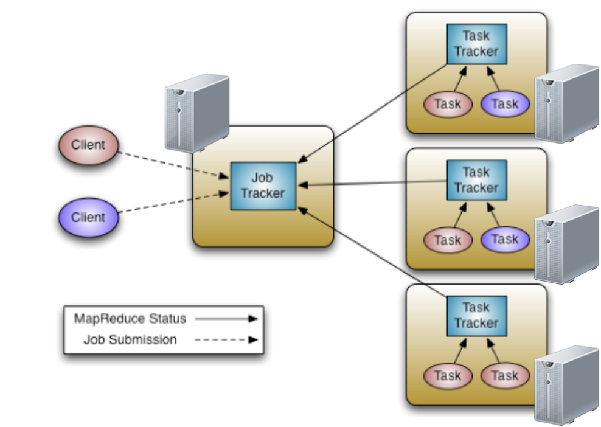

MapReduce is a programming model for distributed data processing across multiple nodes. The programs are designed to compute large volumes of data in a parallel fashion. MapReduce works by breaking the processing into two main phases: Map phase and Reduce phase.

MapReduce execution framework allows the following:

* Automatic parallelization and distribution
* Fault tolerance
* Abstraction for programmers

Refer to [MapReduce Tutorial](https://hadoop.apache.org/docs/current/hadoop-mapreduce-client/hadoop-mapreduce-client-core/MapReduceTutorial.html){: target="_blank"} for more details.


## MapReduce Framework



## MapReduce Phases

__Map phase__

* Map phase is usually for filtering or transforming data. Each mapper performs a user-defined operation on a single HDFS block
* Map tasks run on the node where the data block is stored
* Input: key/value pair
* Output: A list of zero or more key value/pairs

__Partition - Shuffle and sort phase__

* Partitioner: Guarantees all pairs with the same key go to the same Reduce
* Shuffling: Moving map outputs to the reducers
* Sorting: The set of intermediate keys on a single node is sorted before passing to the reducer

__Reduce phase__

* Read all results for each key and performs a user-defined operation, for example: aggregations
* The Reducer outputs zero or more final key/value pairs to the HDFS

## Coding with MapReduce

### Data Types and Formats

* Keys and values are java objects
* Writable interface for serialization
* Values implement Writable interface
* Keys implement WritableComparable interface
* IntWritable – int
* LongWritable – Long
* FloatWritable – Float
* DoubleWritable - Double
* Text – String values


### Let’s examine our first MapReduce program

A typical MapReduce program consists of three main parts: Driver, Mapper and Reducer code.

__Driver Code__

* Contains Job configuration and submission details
* Configurations not explicitly set in your driver code will be read from your Hadoop configuration files (/etc/hadoop/conf)

Examine the below sample for Driver Code of word count example:

```java
public static void main(String args[]) throws Exception {
    Configuration conf = new Configuration();
    Job job = new Job(conf,"word count");

    job.setInputFormatClass(TextInputFormat.class);
    job.setJarByClass(WordCount.class);

    job.setMapperClass(WCMapper.class);
    job.setReducerClass(WCReducer.class);

    job.setMapOutputKeyClass(Text.class);
    job.setMapOutputValueClass(IntWritable.class);
    job.setOutputKeyClass(Text.class);
    job.setOutputValueClass(IntWritable.class);

    job.setOutputFormatClass(TextOutputFormat.class);

    FileInputFormat.addInputPath(job, new Path(args[0]));
    FileOutputFormat.setOutputPath(job, new Path(args[1]));
    System.exit(job.waitForCompletion(true) ? 0 : 1);
}
```
__Mapper Code__

* Extend Mapper base class
* Override map()
* Input: key/value
* Output: key/value

Sample for Map class for word count example:

```java
static class WCMapper extends Mapper<Object, Text, Text, IntWritable> {
    public final static IntWritable one = new IntWritable(1);
    private Text word = new Text();

    public void map(Object key, Text value, Context context)
    throws IOException, InterruptedException {
        System.out.println(key);
        System.out.println(value);
        StringTokenizer itr = new StringTokenizer(value.toString());
        while (itr.hasMoreTokens()) {
            word.set(itr.nextToken());
            context.write(word, one);
        }
    }
}
```
__Reducer Code__

* Extend Reducer base class
* Override reduce()
* Input: key/collection of values
* Output: key/value

Sample for Reduce class for word count example:

```java
static class WCReducer extends Reducer<Text, IntWritable, Text, IntWritable> {
    private IntWritable result = new IntWritable();
    
    protected void reduce(Text key, Iterable<IntWritable> values, Context context)
    throws IOException, InterruptedException {
        int sum = 0;
        for (IntWritable value : values)
            sum += value.get();
        result.set(sum);
        context.write(key, result);
    }
}
```

### Running the program

* Download [bible_shakespear](resources/bible_shakes.nopunc.gz){: target="_blank"} data set
* Decompress and move to HDFS

```shell
hdfs dfs -put bible_shakes.nopunc /user/<your_user>
```

* Download source code for [word count example](resources/wordcount.zip){: target="_blank"}
* Compile the code and create a jar (You can download this [wordcount.jar](resources/wordcount.jar){: target="_blank"} for testing)
* To execute a MapReduce job:


```shell
/bin/hadoop jar <jar-name> <main-class> <input-path> <output-path>
```

* Use the following command to run our example:

```shell
/bin/hadoop jar wordcount.jar  exascale.info.lab.wordcount.WordCount /user/<your_user>/bible_shakes.nopunc /user/<your_user>/<output_folder>
```

* Monitor the job status and examine the logs:

[https://hadoop-rm.daplab.ch/cluster](https://hadoop-rm.daplab.ch/cluster){: target="_blank"}

* Examine the output in HDFS


## Implementation Pointers

### Number of Mappers and Reducers

* The number of mappers typically depends on the input data and the block size
* The number of reducers can be set in your driver code, as follows:

```java
job.setNumReduceTasks(numReducers);
```

* Having only one reducer for large input data can cause a bottleneck
* To many reducers will create extensive network traffic

### Creating Map only jobs

Some jobs only require a map task. For example, file conversions, and data sampling.

To create a map only job:

* Set the number of reducers to 0:

```java
job.setNumReduceTasks(0);
```

* Specify output types:

```java
job.setOutputKeyClass(Text.class);
job.setOutputValueClass(IntWritable.class);
```

### Combiners

* We can introduce an additional step for optimizing bandwidth usage in our MapReduce job.

* The combiner is a “mini reduce” process which operates on data generated by one node to reduce the network traffic

* To add a combiner in our word count example, add the following line in the driver code:

```java
job.setCombinerClass(WCReducer.class);
```


## Example 2 - Bigrams count

* Use the [bible_shakespear](resources/bible_shakes.nopunc.gz){: target="_blank"} data set again
* Write a MapReduce program to count the co-occurrences of pairs of words
* For simplicity, you can use this [bigrams_Helper.zip](resources/bigrams_Helper.zip){: target="_blank"} program structure and build upon it
* Monitor the progress of your job
* Examine the output
* Use the combiner class to optimize your job

??? Solution

    * There are a number of ways to code this, this is one way:
    
    In Mapper class:
    
    ```java
    String[] Tokens = Bigrams.textToString(value);
    for(int i = 0; i < Tokens.length - 1; i++) {
        word.set(Tokens[i] + " " +  Tokens[i+1]);
        context.write(word, one);}
    ```
    
    * To convert the Text value recieved by each map to String[]:
    
    ```java
    public static String[] textToString(Text value) {
        String text = value.toString();
        text = text.toLowerCase();
        text = text.replaceAll("[^a-z]+", " ");
        text = text.replaceAll("^\\s+", "");
        StringTokenizer itr = new StringTokenizer(text);
        ArrayList<String> result = new ArrayList<String>();
        while (itr.hasMoreTokens())
            result.add(itr.nextToken());
        return Arrays.copyOf(result.toArray(),result.size(),String[].class);}
    ```
    
    In Reducer class:
    
    * We can use the same reducer as in the word count example, because we need to sum the values of the received keys (in this case the keys emitted by the mappers are bigrams):
    ```java
    int sum = 0;
    for (IntWritable value : values)
        sum += value.get();
    result.set(sum);
    context.write(key, result);
    ```
    


## Further exercises


* Length Histogram: Write a MapReduce program to count the occurrences for ranges of lengths of words.


