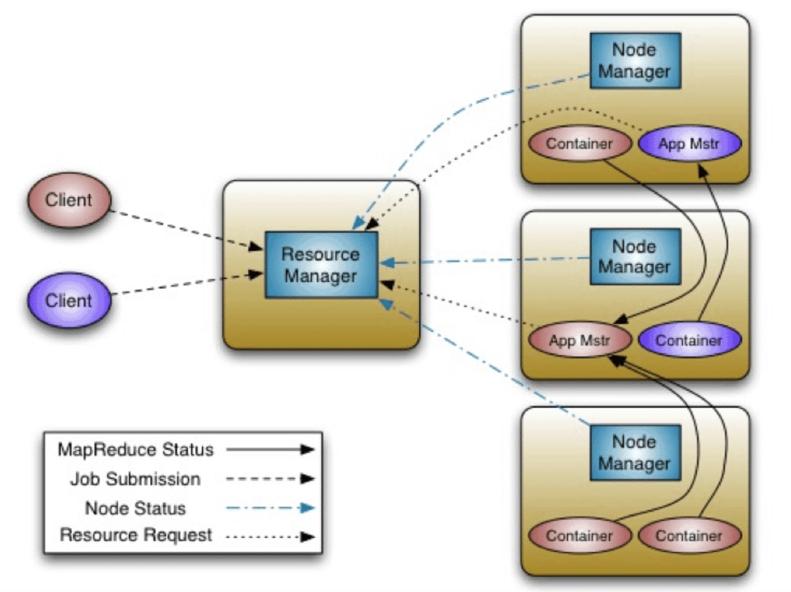

MapReduce is a programming model for distributed data processing across multiple nodes. The programs are designed to compute large volumes of data in a parallel fashion. MapReduce works by breaking the processing into two main phases: Map phase and Reduce phase.

MapReduce execution framework allows the following:

* Automatic parallelization and distribution
* Fault tolerance
* Abstraction for programmers

## MapReduce Framework



## MapReduce Phases

__Map phase__

* Map phase is usually for filtering or transforming data. Each mapper performs a user-defined operation on a single HDFS block
* Map tasks run on the node where the data block is stored
* Input: key/value pair
* Output: A list of zero or more key value/pairs

__Partition - Shuffle and sort phase__

* Partitioner: Determines which partition a given (key,value) pair will go to
* Shuffling: Moving map outputs to the reducers
* Sorting: The set of intermediate keys on a single node is sorted before passing to the reducer

__Reduce phase__

* Read all results for each key and performs a user-defined operation, for example: aggregations
* The Reducer outputs zero or more final key/value pairs to the HDFS

## Coding with MapReduce

### Data Types and Formats

* Keys and values are java objects
* Writable interface for serialization
* Values implement Writable interface
* Keys implement WritableComparable interface
* IntWritable – int
* LongWritable – Long
* FloatWritable – Float
* DoubleWritable - Double
* Text – String values


### Let’s examine our first MapReduce program

A typical MapReduce program consists of three main parts: Driver, Mapper and Reducer code.

__Driver Code__

* Contains Job configuration and submission details
* Configurations not explicitly set in your driver code will be read from your Hadoop configuration files (/etc/hadoop/conf)

Examine the below sample for Driver Code of word count example:

```java
public static void main(String args[]) throws Exception {
    Configuration conf = new Configuration();
    Job job = new Job(conf,"word count");

    job.setInputFormatClass(TextInputFormat.class);
    job.setJarByClass(WordCount.class);

    job.setMapperClass(WCMapper.class);
    job.setReducerClass(WCReducer.class);

    job.setMapOutputKeyClass(Text.class);
    job.setMapOutputValueClass(IntWritable.class);
    job.setOutputKeyClass(Text.class);
    job.setOutputValueClass(IntWritable.class);

    job.setOutputFormatClass(TextOutputFormat.class);

    FileInputFormat.addInputPath(job, new Path(args[0]));
    FileOutputFormat.setOutputPath(job, new Path(args[1]));
    System.exit(job.waitForCompletion(true) ? 0 : 1);
}
```
__Mapper Code__

* Extend Mapper base class
* Override map()
* Input: key/value
* Output: key/value

Sample for Map class for word count example:

```java
static class WCMapper extends Mapper<Object, Text, Text, IntWritable> {
    public final static IntWritable one = new IntWritable(1);
    private Text word = new Text();

    public void map(Object key, Text value, Context context)
    throws IOException, InterruptedException {
        System.out.println(key);
        System.out.println(value);
        StringTokenizer itr = new StringTokenizer(value.toString());
        while (itr.hasMoreTokens()) {
            word.set(itr.nextToken());
            context.write(word, one);
        }
    }
}
```
__Reducer Code__

* Extend Reducer base class
* Override reduce()
* Input: key/collection of values
* Output: key/value

Sample for Reduce class for word count example:

```java
static class WCReducer extends Reducer<Text, IntWritable, Text, IntWritable> {
    private IntWritable result = new IntWritable();
    
    protected void reduce(Text key, Iterable<IntWritable> values, Context context)
    throws IOException, InterruptedException {
        int sum = 0;
        for (IntWritable value : values)
            sum += value.get();
        result.set(sum);
        context.write(key, result);
    }
}
```

### Running the program

* Download [source code] for word count example
* Compile the code and create a jar
* We will use the same [data set] which should be already loaded to HDFS
* Use the following command to execute the job:

```${HADOOP_HOME}/bin/hadoop jar <jar-name>  <main-class> <input-path> <output-path>
```

* Examine the logs
* Examine the output


## Implementation Tips

* Input splits
* Counters
* Distributed cache
* Number of mappers and reducers

## Bigrams count

* Write a MapReduce program to count the co-occurrences of pairs of words in the [data set]
* For simplicity, you can use this [code helper] program structure and build upon it
* Monitor the progress of your job
* Examine the output
* Use the combiner class to optimize your job


