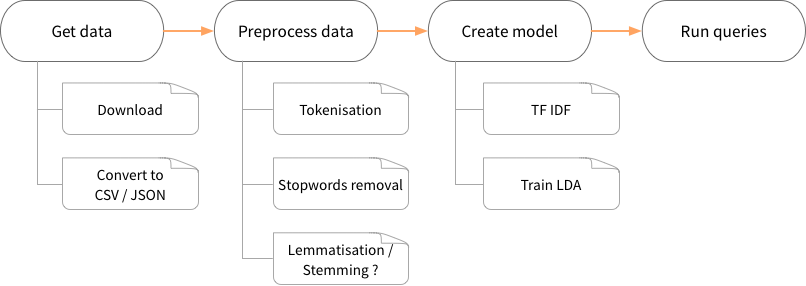

In this workshop, we will create a search engine for BBC articles using pyspark and the Spark ML library. 

* [pyspark documentation](){: target="_blank"}
* [ML guide](https://spark.apache.org/docs/2.1.0/ml-guide.html){: target="_blank"}

!!! info ""
    The full notebook with all the answers can be downloaded [here](resources/bbc-workshop.json){: target="_blank"}. Just ensure _Batting.csv_ and _QueryEngine.py_ are present in the `data` folder before running it.

## Introduction 

### What we will do

To create the search engine, we will do the following steps:



### What we will use

LSA, _latent semantic anlysis_ is

> _a technique in natural language processing, in particular distributional semantics, of analyzing relationships between a set of documents and the terms they contain by producing a set of concepts related to the documents and terms_ (source: wikipedia)

In summary, we want to establish underlying relationships between documents in a collection by linking documents and terms through _concepts_. Those concepts are deduced or constructed through a statistical or mathematical algorithm that forms a _model_. Once we have the model, we can begin using it for search queries.

#### Available algorithms 

There are two well-known methods for discovering underlying topics:

1. __SVD__, _Singular Value Decomposition_: is a mathematical method for decomposing a matrix into a product of smaller matrices. It has the advantage of being _mathematically correct_: computing the model, hence  the decomposed matrices, takes only one pass and is deterministic: the same data will always give the same result (as long as the same parameters are used).

2. __LDA__, _Latent Dirichlet Allocation_, is a generative probabilistic model. Based on statistics, many iterations are necessary to get a good-enough model and every run could give a different result. The result is also highly dependant on the parameters we use for the training. 

In this workshop, we will use the LDA technique.

#### LDA Basics

LDA is like a clustering algorithm where :

* the _cluster centers_ are the topics;
* the _training examples_ are documents;
* the _features_ are the word frequencies;
* the distance is ~~euclidean~~ based on a statistical model (Bayesian inference rules / Dirichlet distribution)

As in clustering, we need to give some informations (_parameters_) to the model. The most important one is __the number of topics (k)__ we think there is (exactly as we need to specify the number of clusters to find).

During training, the model will first assign each document to a random topic. Then, on each iteration, it computes how well the actual topic distribution describes/predicts each document, makes adjustments and try again. Most of the time, the programmer will set in advance the __maximum number of iterations__ to do.

In the end, the model outputs a topic distribution over document (how much a document is important to a given topic) and over terms (how much the term describes the topic). Documents with similar topic distributions are likely to be similar, even if they don't use the same words.

## LDA with pyspark

### Getting the dataset

The dataset "_Dataset: BBC_" available at: [http://mlg.ucd.ie/datasets/bbc.html](http://mlg.ucd.ie/datasets/bbc.html){: target="_blank"} (we used the raw text files).  It consists of 2225 documents from the BBC news website corresponding to stories in five topical areas (business, entertainment, politics, sport and tech) from 2004-2005.

Since the dataset comes in multiple folders and with some duplicates, we already processed it and made it available in csv or json format. If you are interested, you can get [the python script](resources/bbc-transformer.py){: target="_blank"} we used for the parsing.

For the workshop, download [bbc.json](resources/bbc.json){: target="_blank"} and save it in the `snorkel/zeppelin/data` folder.

### Loading the dataset into Spark

Create a new notebook. On the first cell, ensure that the `bbc.json` file is were it should be by running:

```shell
%sh
ls data/bbc.json
```

The file should be listed in the output.

Now, let's load those data into a Spark dataframe ([documentation](https://spark.apache.org/docs/2.1.0/sql-programming-guide.html#json-datasets){: target="_blank"}):

```python
%pyspark
dataset = spark.read.json('data/bbc.json')
```

Ensure this worked by inspecting the dataset:

```python
%pyspark
print("number of documents: %d" % dataset.count())
print("structure: %s" % dataset.describe())
dataset.show()
```

```
number of documents: 2096
structure: DataFrame[summary: string, category: string, content: string, filename: string, title: string]
...
```

### Adding IDs and creating lookup tables

In order to keep track of our articles, let's give each line of our "table" a unique ID:

```python
%pyspark

from pyspark.sql.functions import monotonically_increasing_id
from pyspark.sql.types import LongType

# This will return a new DF with all the columns + id
dataset = dataset.withColumn("id", monotonically_increasing_id())
dataset.show(5)
```

Then, it would be nice to be quickly able to get an ID given a title and vice-versa. So let's create lookup dictionaries:

```python
%pyspark
docTitles =  dict([(r[0], r[1]) for r in dataset.select("id", "title").collect()]) 
docIds = dict([(r[1], r[0]) for r in dataset.select("id", "title").collect()])
```

In those lines, we select two columns from our dataframe: _id_ and _title_. Using `collect`, we ask Spark to actually execute the selection (it is an _action_) and get the results into a list of _Row_. A `Row` behaves like an untyped array. We convert our rows into tuples and finally cast the list of tuples into a dictionary for quick lookup.

To ensure it works, try to lookup the title of the document with ID 0: `docTitles[0]`.

### Features extraction

In our case, the feature extraction is applied on the articles body (column `content`) and contains the following steps:

* breaking content into words (_tokenisation_)
* removing common words (_stopwords removal_)
* computing the frequencies of each word (_count vectors_) and selecting a subset of words (_vocabulary_)
* computing the TF-IDF over documents and vocabulary

As you will see, all those steps are very common and can be performed using Spark ML utilities.

#### Tokenisation

The first thing to do is to break our article's content into tokens. 

Have a look at the Spark ML documentation and try to figure out how to tokenise our `content` column: [Spark ML documentation: tokenizer](https://spark.apache.org/docs/2.1.0/ml-features.html#tokenizer){: target="_blank"}.

_Tips_: discard words of less than 4 characters, save the result into a `tokens` column.

??? Solution
    We use the `RegexTokenizer` with the following arguments:
    
    * `regex`: break by white space character(s) 
    * `inputCol`: name of the input column, here `content`
    * `outputCol`: name of the new column with tokens, here `tokens`
    * `minTokenLength`: discard tokens with length < 4

    ```python
    %pyspark
    # import the RegexTokenizer class
    from pyspark.ml.feature import RegexTokenizer
    # create  a new tokenizer instance
    tokenizer = RegexTokenizer(pattern="[\\W_]+", inputCol="content", 
        outputCol="tokens", minTokenLength=4)
    # tokenise (and select only the interesting columns to gain space)
    tokenized_df = tokenizer.transform(dataset).select("id", "title", "content", "tokens")
    ```

To visualize the results, lets print the first 100 characters of the first article and some of the resulting tokens:
```python
%pyspark

content = tokenized_df.select("content").first()
tokens = tokenized_df.select("tokens").first()

print("content: %s..." % content[0][:100])
print("tokens:  %s.." % ", ".join(tokens[0][:10]))
```

Result:
```
content: Quarterly profits at US media giant TimeWarner jumped 76% to $1.13bn (£600m) for the three months to...
tokens:  quarterly, profits, media, giant, timewarner, jumped, 13bn, 600m, three, months..
```

??? tip "The difficulties of tokenisation"
    Tokenisation is very important in language processing, but it is not an easy task. Here, we separated words based on spaces and removed small words. But is it always a good idea ? It depends... For example:

    * `quarterly profit` --> `quarterly`, `profit` seems good. But what about `New York` ? Breaking it down into two tokens might change the way our search engine treats a query about `New York`... Indeed, if it is considered two tokens, a document with a text "there is a _new_ professor at the _York_ university" becomes relevant as well;
    * By removing small words, we might loose informations, such as `US` or `USA`;
    * Here, our tokeniser treats `13bn` or `600m` as tokens. But we can wonder if words with non-letter characters should be kept or not.
 
    In real-life applications, the tokenizer is often way more complex and augmented with context-sensitive rules and heuristics.

#### Stopwords removal

We want to remove common words that are likely to appear in every document, hence not very informative. Here, we will use the following:

```python
%pyspark
# stopwords to use: copy-paste it into a cell
stopwords = "above,abst,accordance,according,accordingly,across,act,actually,added,adj,affected,affecting,affects,after,afterwards,again,against,ah,all,almost,alone,along,already,also,although,always,am,among,amongst,an,and,announce,another,any,anybody,anyhow,anymore,anyone,anything,anyway,anyways,anywhere,apparently,approximately,are,aren,arent,arise,around,as,aside,ask,asking,at,auth,available,away,awfully,b,back,be,became,because,become,becomes,becoming,been,before,beforehand,begin,beginning,beginnings,begins,behind,being,believe,below,beside,besides,between,beyond,biol,both,brief,briefly,but,by,c,ca,came,can,cannot,can't,cause,causes,certain,certainly,co,com,come,comes,contain,containing,contains,could,couldnt,d,date,did,didn't,different,do,does,doesn't,doing,done,don't,down,downwards,due,during,e,each,ed,edu,effect,eg,eight,eighty,either,else,elsewhere,end,ending,enough,especially,et,et-al,etc,even,ever,every,everybody,everyone,everything,everywhere,ex,except,f,far,few,ff,fifth,first,five,fix,followed,following,follows,for,former,formerly,forth,found,four,from,further,furthermore,g,gave,get,gets,getting,give,given,gives,giving,go,goes,gone,got,gotten,h,had,happens,hardly,has,hasn't,have,haven't,having,he,hed,hence,her,here,hereafter,hereby,herein,heres,hereupon,hers,herself,hes,hi,hid,him,himself,his,hither,home,how,howbeit,however,hundred,i,id,ie,if,i'll,im,immediate,immediately,importance,important,in,inc,indeed,index,information,instead,into,invention,inward,is,isn't,it,itd,it'll,its,itself,i've,j,just,k,keep,keeps,kept,kg,km,know,known,knows,l,largely,last,lately,later,latter,latterly,least,less,lest,let,lets,like,liked,likely,line,little,'ll,look,looking,looks,ltd,m,made,mainly,make,makes,many,may,maybe,me,mean,means,meantime,meanwhile,merely,mg,might,million,miss,ml,more,moreover,most,mostly,mr,mrs,much,mug,must,my,myself,n,na,name,namely,nay,nd,near,nearly,necessarily,necessary,need,needs,neither,never,nevertheless,new,next,nine,ninety,no,nobody,non,none,nonetheless,noone,nor,normally,nos,not,noted,nothing,now,nowhere,o,obtain,obtained,obviously,of,off,often,oh,ok,okay,old,omitted,on,once,one,ones,only,onto,or,ord,other,others,otherwise,ought,our,ours,ourselves,out,outside,over,overall,owing,own,p,page,pages,part,particular,particularly,past,per,perhaps,placed,please,plus,poorly,possible,possibly,potentially,pp,predominantly,present,previously,primarily,probably,promptly,proud,provides,put,q,que,quickly,quite,qv,r,ran,rather,rd,re,readily,really,recent,recently,ref,refs,regarding,regardless,regards,related,relatively,research,respectively,resulted,resulting,results,right,run,s,said,same,saw,say,saying,says,sec,section,see,seeing,seem,seemed,seeming,seems,seen,self,selves,sent,seven,several,shall,she,shed,she'll,shes,should,shouldn't,show,showed,shown,showns,shows,significant,significantly,similar,similarly,since,six,slightly,so,some,somebody,somehow,someone,somethan,something,sometime,sometimes,somewhat,somewhere,soon,sorry,specifically,specified,specify,specifying,still,stop,strongly,sub,substantially,successfully,such,sufficiently,suggest,sup,sure,t,take,taken,taking,tell,tends,th,than,thank,thanks,thanx,that,that'll,thats,that've,the,their,theirs,them,themselves,then,thence,there,thereafter,thereby,thered,therefore,therein,there'll,thereof,therere,theres,thereto,thereupon,there've,these,they,theyd,they'll,theyre,they've,think,this,those,thou,though,thoughh,thousand,throug,through,throughout,thru,thus,til,tip,to,together,too,took,toward,towards,tried,tries,truly,try,trying,ts,twice,two,u,un,under,unfortunately,unless,unlike,unlikely,until,unto,up,upon,ups,us,use,used,useful,usefully,usefulness,uses,using,usually,v,value,various,'ve,very,via,viz,vol,vols,vs,w,want,wants,was,wasnt,way,we,wed,welcome,we'll,went,were,werent,we've,what,whatever,what'll,whats,when,whence,whenever,where,whereafter,whereas,whereby,wherein,wheres,whereupon,wherever,whether,which,while,whim,whither,who,whod,whoever,whole,who'll,whom,whomever,whos,whose,why,widely,willing,wish,with,within,without,wont,words,world,would,wouldnt,www,x,y,yes,yet,you,youd,you'll,your,youre,yours,yourself,yourselves,you've,z,zero,article,about,writes,entry,well,will,newsgroup".split(",")
```

Look at the [Spark ML documentation](https://spark.apache.org/docs/2.1.0/ml-features.html#stopwordsremover){: target="_blank"} to remove all the stopwords from our `tokens` column using a `StopWordsRemover`.

??? solution
    The code is very similar to the tokenisation one:

    ```python
    %pyspark
    from pyspark.ml.feature import StopWordsRemover

    remover = StopWordsRemover(inputCol="tokens", outputCol="filtered", stopWords=stopwords)
    filtered_df = remover.transform(tokenized_df)
    ``` 

To visualise the results, let's print the first 18 tokens of a document, with and without stopwords:

```python
%pyspark
tokens = filtered_df.select("tokens").first()
filtered_tokens = filtered_df.select("filtered").first()

print("  tokens: %s" % ", ".join(tokens[0][:18]))
print("filtered: %s" % ", ".join(filtered_tokens[0][:18]))
```

Result:

```
  tokens: quarterly, profits, media, giant, timewarner, jumped, 13bn, 600m, three, months, december, from, 639m, year, earlier, firm, which, biggest
filtered: quarterly, profits, media, giant, timewarner, jumped, 13bn, 600m, three, months, december, 639m, year, earlier, firm, biggest, investors, google
```
Here, `from` and `which` have been removed.

#### Word frequencies and vocabulary

Using the [Spark ML CountVectorizer](https://spark.apache.org/docs/2.1.0/ml-features.html#countvectorizer){: target="_blank"}, try to find how to create a model with a vocabulary of 3000 words and a minimum document frequency of 5. Then, use the model over our `filtered_df` dataset to create a new column named `token_counts`.

??? Solution
    ```python
    %pyspark
    from pyspark.ml.feature import CountVectorizer

    vocabSize = 3000 # the maximum number of term to retain
    minDF = 5        # the minimum number of different documents a 
                     # term must appear in to be included in the vocabulary.

    vectorizer = CountVectorizer(inputCol = "filtered", outputCol = "token_counts", vocabSize=vocabSize, minDF=minDF)

    count_model = vectorizer.fit(filtered_df)       # create model
    counted_df = count_model.transform(filtered_df) # apply model to our df
    vocabulary = count_model.vocabulary             # extract the vocabulary
    ```

If you look at our `token_counts` column, here is what we get:

```python
%pyspark
first_doc_freqs = counted_df.select("token_counts").first()
first_doc_freqs[0]
```

```
SparseVector(3000, {0: 4.0, 2: 2.0, 8: 2.0, 9: 2.0, 11: 1.0, 13: 1.0, 14: 2.0, 25: 1.0, 32: 2.0, 40: 3.0, 43: 1.0, 44: 1.0, 47: 1.0, 55: 1.0, 56: 1.0, 57: 2.0, 65: 2.0, 67: 1.0, 68: 1.0, 69: 2.0, 71: 1.0, 85: 1.0, 89: 1.0, 102: 1.0, 109: 1.0, 115: 1.0, 118: 1.0, 119: 1.0, 123: 1.0, 132: 1.0, 137: 2.0, 140: 4.0, 149: 1.0, 150: 1.0, 156: 1.0, 159: 1.0, 160: 1.0, 161: 1.0, 170: 2.0, 179: 3.0, 189: 1.0, 190: 1.0, 202: 1.0, 205: 1.0, 209: 2.0, 227: 1.0, 248: 1.0, 249: 1.0, 261: 1.0, 283: 1.0, 300: 2.0, 327: 1.0, 331: 2.0, 333: 1.0, 340: 3.0, 342: 1.0, 360: 5.0, 364: 2.0, 410: 1.0, 440: 1.0, 464: 1.0, 467: 1.0, 489: 1.0, 498: 1.0, 504: 1.0, 544: 2.0, 549: 1.0, 560: 1.0, 562: 1.0, 589: 2.0, 632: 1.0, 687: 4.0, 742: 2.0, 779: 1.0, 780: 1.0, 797: 1.0, 806: 3.0, 828: 1.0, 890: 1.0, 931: 1.0, 938: 1.0, 951: 1.0, 960: 1.0, 971: 1.0, 1017: 2.0, 1066: 1.0, 1129: 1.0, 1177: 2.0, 1290: 1.0, 1311: 1.0, 1360: 1.0, 1437: 1.0, 1451: 1.0, 1462: 1.0, 1597: 2.0, 1639: 1.0, 1674: 1.0, 1719: 1.0, 1732: 1.0, 1733: 1.0, 1906: 1.0, 1987: 1.0, 2034: 1.0, 2090: 1.0, 2120: 1.0, 2188: 1.0, 2199: 1.0, 2265: 1.0, 2305: 2.0, 2306: 1.0, 2392: 1.0, 2443: 1.0, 2467: 1.0, 2670: 1.0, 2742: 1.0})
```

??? tip "About SparseVector"
    A sparse vector is just a way to compress a vector when it is filled mainly with zeroes. The idea is to only keep track of the length of the vector and the cells with a non-zero value. So in this `SparseVector`, we have 3000 entries. Index 0 has value `4`, index 1 has value 0, index 2 has value `2`, etc. Each index corresponds to the token at the same index in the `vocabulary`. 

    You can convert a `SparseVector` back into a "normal" vector (called a `DenseVector`) using:
    ```python
    from pyspark.ml.linalg import Vectors
    Vectors.Dense(mySparseVector)
    ```


The `token_counts` column contains a vector of length `len(vocabulary)`. The value at index `x` corresponds to the frequency of the token at index `x` in the `vocabulary`:

```python
first_doc_freqs = counted_df.select("token_counts").first()[0]
print("frequencies of the first ten words of the vocabulary in the first document:")
for i in range(10):
    print("%-10s: %d" % (vocabulary[i], first_doc_freqs[i]))
```

Result:
```
frequencies of the first ten words of the vocabulary in the first document:
year      : 4
people    : 0
time      : 2
government: 0
years     : 0
best      : 0
told      : 0
game      : 0
three     : 2
film      : 2
```

#### TF-IDF

The _term frequency–inverse document frequency_ (TF-IDF) is often used in information retrieval and search engine. The basic idea is:

1. the more often a searched term appears in a document, the more relevant the document is relative to the search (_term frequency_);
2. the more often a term appears in a corpus of document, the less informative/discriminative it is (_inverse document frequency_).

So the TF-IDF is a way to give different weights to search terms and results, in order to get more relevant results.

We already computed the term frequencies using the `CountVectorizer`. The only thing left to do is to compute the IDF: 
$$ 
idf_t = \frac{N}{df_t}
$$
where _N_ is the number of documents in the corpus and df~t~ is the number of documents in which ~t~ appears.

In Spark ML, the [IDF](https://people.apache.org/~pwendell/spark-releases/spark-2.1.0-rc1-docs/ml-features.html#tf-idf){: target="_blank"} class takes care of everything:

>  IDF is an Estimator which is fit on a dataset and produces an IDFModel. The IDFModel takes feature vectors (generally created from HashingTF or CountVectorizer) and scales each column. Intuitively, it down-weights columns which appear frequently in a corpus.

```python
%pyspark
from pyspark.ml.feature import IDF

idf = IDF(inputCol = "token_counts", outputCol = "features")
idf_model = idf.fit(counted_df)
# apply the model and keep only the relevant columns
features_df = idf_model.transform(counted_df).select("id", "title", "content", "features")
```

### Creating the model

Now, that we have our features, let's train an LDA model.

There are many parameters to fine-tune an [LDA model](https://spark.apache.org/docs/2.1.1/api/python/pyspark.ml.html#pyspark.ml.clustering.LDA){: target="_blank"}. Right now, we will just set two of them:

* `k`: the number of topics (or clusters) to find;
* `maxIter`: the maximum number of iterations to do.

Based on the [LDA example](https://spark.apache.org/docs/2.1.1/ml-clustering.html#latent-dirichlet-allocation-lda){: target="_blank"}, we create the model with:

```python
%pyspark
from pyspark.ml.clustering import LDA

# set parameters
k = 10        # number of topics
maxIter = 10 # low boundary: might not be incredible, but it will be quick

# train a LDA model.
lda = LDA(k=k, maxIter=maxIter, featuresCol="features")
model = lda.fit(features_df)

# Add the result to the dataframe
transformed = model.transform(features_df)
```

The LDA model gives us two important things:

1. `model.topicsMatrix()`: the inferred topics, where each topic is represented by a distribution over terms. It is a matrix of size `len(vocabulary)` x `k`, where each column is a topic: value at row 1 and column 2 tells the importance of term 1 for topic 2. 
2. the column `topicDistribution` in the `transformed` dataframe: it is a vector of size `k` whose values are the importance of the document for each topic;

Having the relations _term_ <--> _topic_ and _topic_ <--> _document_, we can also deduce the relations _term_ <--> _document_ (transitivity). 

### Describing the topics 

Ok, now let's look at our topics. The model is not able to tell us exactly what they are, but we can list the most relevant terms of the vocabulary for each topic:

```python
%pyspark
# This returns a DataFrame[topic: int, termIndices: array<int>, termWeights: array<double>]
topics = model.describeTopics(5) # get the top 5 words

# Let's replace the termIndices by the actual terms
topics_descr = topics.rdd.map(lambda r: (r[0],  [vocabulary[i] for i in r[1]])).collect()

# use a zeppelin trick to display a nice table:
print("The topics described by their top-weighted terms:")
print("%table\nid\tterms")
for r in topics_descr:
    print("%s\t%s" % (r[0], ", ".join(r[1])))
```

??? tip "Printing tables with Zeppelin"
    If you output the `%table` _shebang_ followed by lines (ending with `\n`) with tabs (`\t`), Zeppelin automagically convert it to a table. Example:
    ```
    %pyspark
    print("""
    %table
    header 1    header 2
    cell 1,1    cell 1,2
    cell 2,1    cell 2,1
    """)
    ```

### QueryEngine

To simplify, here is [a python script](resources/QueryEngine.py){: target="_blank"} defining a `QueryEngine` class. 

#### Creating a QueryEngine

Either copy-paste its content to a new cell or save it to `zeppelin/data` and import it to the notebook using the following snippet:

```python
%pyspark
exec(open('data/QueryEngine.py').read())
```


??? tip "QueryEngine methods"
    You can type `help(QueryEngine)` in a new cell to get the list of available methods. Here is a summary:

    - `showDoc(docId)`: returns the title and content of a document as a string;
    - `topDocsForDoc(docId, top=10)`: returns the most relevant documents for a given document;
    - `topDocsForTerm(termId, top=10)`: returns the most relevant documents for a given term;
    - `topDocsForTermQuery(termIds, top=10)`: returns the most relevant document for a given list of terms;
    - `topTermsForTerm(termId, top=10)`: returns the most relevant terms for a given term.


Create a new `QueryEngine` instance:

```python
%pyspark
q =  QueryEngine(model, transformed, vocabulary, idf_model)
```

#### Using the QueryEngine

Type `help(q)` to list the `QueryEngine` method and try the different search functions.

!!! tip ""
    You might notice that the `QueryEngine` works with term and document _IDs_. 

    To work with term ids, use the `vocabulary`:

    - `vocabulary.index("computer")`: returns the id of the term _computer_, or `-1` if the term is not in the vocabulary;
    - `vocabulary[10]`: returns the _term_ at id `10`;

    For documents, use the _lookup tables_ created at the beginning:

    - `docTitles[0]`: returns the title of document `0`;
    - `docIds['Awesome title']`: returns the ID of the document with title _Awesome title_;

!!! tip ""
    To display the results nicely, you can use the `result2tables(result)` method, or simply call `toTable()` on the results. 

Here is an example:
```python
%pyspark
# looking for documents related to term "computer"
termId = vocabulary.index("computer")
q.topDocsForTerm(termId).toTable() # or: results2table(q.topDocsForTerm(termId))
```

### Interactive queries

#### Search in titles

First, let's have an interactive cell to search in the document titles. 

The `z.input(name, default_value)` let's you create an interactive form. 

The `filter` method on a dataframe accepts an SQL like clause. For example `id > 300`, `content LIKE '%computer%'` or `lower(title) = 'weak dollar hits reuters'`.

Using this, we can create an interactive form for searching for strings in the title:

```python
%pyspark
terms = z.input("search in title:", "computer") # get input from the user

# do the query 
results = transformed\
    .select("id", "title")\
    .filter("lower(title) LIKE '%" + terms + "%'")\
    .collect()
  
# print the results
print("%table")
print("id\ttitle")
for row in results:
    print("%d\t%s" % (row[0], row[1]))
```

#### Top docs for term

Try to write an interactive query where the user enters a term and the system displays the most relevant documents.

!!! failure ""
    Be careful: you need to ensure the term is part of the vocabulary (and retrieve its ID) before calling the `QueryEngine`.

??? Solution

    Here is one way to do it:
    ```python
    %pyspark
    import random

    # get the input
    term = z.input("term:")

    if term != "" and term in vocabulary:
        # the term is in the vocabulary, we can proceed
        termId = vocabulary.index(term)
        print("results for term: %s (%d)" % (term, termId))
        q.topDocsForTerm(termId).toTable()
    else:
        # oups: not in the vocabulary. List some random terms instead.
        print("%s is not in the vocabulary. Try: %s..." % (term, ", ".join(random.sample(vocabulary, 10)) ))
    ```

#### Top terms for term

Using nearly the same code as above, we can also list the most relevant terms for a term.

??? Solution
    Simply replace `q.topDocsForTerm(termId)` with `q.topTermsForTerm(termId)` in the code above.

#### Top docs for terms

Here, we do quite the same as above, but let the user enter multiple terms (the relevant `QueryEngine` method is `topDocsForTermQuery`).

??? Solution
    ```python
    %pyspark
    import random

    # get the input
    terms = z.input("terms, space-separated:")

    # prepare random terms
    random_terms = ", ".join(random.sample(vocabulary, 10))

    if term != "":
        # the term is in the vocabulary, we can proceed
        termIds = [vocabulary.index(t) for t in terms.split(" ") if t in vocabulary]
        if len(termIds) > 0:
            print("looking for documents matching %s" % [vocabulary[id] for id in termIds])
            q.topDocsForTermQuery(termIds).toTable()
        else:
            print("sorry, those terms are not in the vocabulary. Try: %s" % random_terms)
    else:
        # no input. Suggest some terms
        print("Try: %s..." % random_terms)

    ```

#### Top docs for doc

Here is a code for creating a dropdown with document titles:

```python
%pyspark
# tip: for better performances, move the next line to its own cell and execute it once only
docSelection = [(r[0], "%d - %s" % (r[0], r[1])) for r in transformed.select("id", "title").collect()]
# display the dropdown
docId = z.select("document", docSelection, 1)
```

The `docId` is the ID of the selected document. Add the code necessary to list relevant documents.

??? Solution
    ```python
    %pyspark
    docSelection = [(r[0], "%d - %s" % (r[0], r[1])) for r in transformed.select("id", "title").collect()]
    docId = z.select("document", docSelection, 1)

    print("Top documents for doc #%d" % docId)
    q.topDocsForDoc(docId).toTable()
    ```

## Where to go from here

Considering our application, there are many things we could change/enhance. For example:

* we chose a bit randomly `k = 10`. From the information we have on our data, another value for `k` could yield better results. The same holds for the size of the vocabulary (set to `3000`);
* concerning the preprocessing, we could:
    - use different stopwords or even skip the stopwords removal step;
    - use _lemmatization_ or _stemming_ to group words from the same family/root into _token classes_;
    - change the TF-IDF formula to finetune our scoring system;
    - ...

There are also other techniques for LSA, like the _SVD_ algorithm we mentioned in the introduction. Spark ML offers an implementation of _SVD_ that can yield the same kind of results (let me know if you are interested, I can give you some pointers :wink:).
