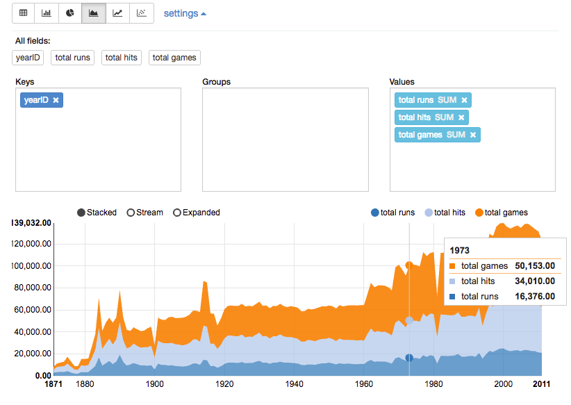

Apache Zeppelin is an online notebook that lets you interact with a HADOOP cluster (or any other hadoop/spark installation) through many languages and technology backends. 

In this workshop, we will use Zeppelin to explore data with Spark. 

## Environment setup

To simplify, we will use a local Zeppelin running on a Docker container on your local machine. 

??? Info "What is Docker?"
    Docker is a tool designed to make it easier to create, deploy, and run applications by using _containers_.

    Containers are a way to package software in a format that can run isolated on a shared operating system. Unlike VMs, containers do not bundle a full operating system - only libraries and settings required to make the software work are needed. This makes for efficient, lightweight, self-contained systems and guarantees that software will always run the same, regardless of where it’s deployed.

By now, you should have Docker running on your machine as well as snorkel set up. Simply start zeppelin (see [how to setup Snorkel ?](index.md#setting-up-snorkel)) and navigate to [http://localhost:8080/](http://localhost:8080/){: target="_blank"}.


## Getting Started

### Creating a new notebook

On the home page or on the notebook menu, select "_create new..._". Once the notebook is opened, give it a new name.

!!! tip "Creating folders"
    Using slashes (`/`) in the notebook name will automatically create and/or move the notebook into folders.

### Basic concepts

A notebook is made of _cells_, also called _paragraphs_. A cell has an _interpreter_ that tells Zeppelin which langage/backend to use to run the cell.

The interpreter is configured by writing `%<interpreter name>` at the top of the cell. Without it, Zeppelin will use the default interpreter, which you can configure by clicking on <i class="fa fa-cog" aria-hidden="true"></i> _> interpreters_ at the top right of the notebook (drag-drop to re-order them, the first one being the default).


You can run cells by clicking on the <i class="fa fa-play" aria-hidden="true"></i> icon on the right or using the shortcut `shift+enter`. 

!!! Tip "shortcuts"
    Many useful shortcuts exist in edit mode. Click on <i class="fa fa-keyboard-o" aria-hidden="true"></i> the at the top right of a notebook to display them.

The first time you run a cell of a given type, an new _instance_ of the interpreter is started (it might take a moment). This instance will then be used for all subsequent run of any cell configured with the same language. This is nice, because it means you can share variables and code between cells. 

!!! Tip "In case of trouble"
    If something goes wrong, you can restart an interpreter any time using the <i class="fa fa-cog" aria-hidden="true"></i> _> interpreters_ and then clicking on the <i class="fa fa-refresh"></i> icon alongside the interpreter name.

### List of interpreter prefixes

Interpreters and prefixes may vary between the installations. On your local Zeppelin, the following interpreters are available: 

| Prefix | Description |
|:-------|:------------|
| `%spark` | Spark (scala) |
| `%pyspark` | Spark (python) |
| `%sql` | Spark SQL |
| `%dep` | special syntax to load external dependencies | 
| `%md` | MarkDown cell |
| `%sh` | shell script (bash) |
| `%python` | "regular" python |

_Note_: `spark` is Spark 1.6, `spark2` is Spark 2.1.0.

### A first example

To test Zeppelin, create a new notebook. 

__Shell cell__: 

On the first cell, enter the snippet below:

```shell
%sh
echo "The working directory is $(pwd), it contains:"
ls
```

As you can see, this is a regular shell script that will run inside the docker container. The working directory is `/zeppelin`, which contains some folders that are also available from your filesystem:

| Zeppelin path | Local path | Description |
|:--------------|:-----------|:------------|
| `/zeppelin/data` | `snorkel/zeppelin/data` | Empty directory you can use to store input and output data |
| `/zeppelin/logs` | `snorkel/zeppelin/logs` | Zeppelin logs |
| `/zeppelin/notebooks` | `snorkel/zeppelin/notebooks` | Where Zeppelin stores the notebooks (in a special `.json` format)... Don't erase it ! |
| `/zeppelin/spark-warehouse` | `snorkel/zeppelin/spark-warehouse` | A special directory used by Spark for storing temp tables and such |

__Markdown cell__:

On a new cell, type some markdown and press `shift+enter`:

```md
%md
# Title
## Subtitle
I am testing the _Zeppelin_ functionalities, specifically the `%markdown` 
interpreter. I can even do some nice __latex math__ using the \$\$ delimiters!
Example:

$$ \frac{N}{4} * log(t) $$
```

__Let's do some python:__

On a new cell, type the following:

```python
%python
range(0,10)
```

You should have the result `[0, 1, 2, 3, 4, 5, 6, 7, 8, 9]` displayed. Now, store the result into a variable:

```python
%python
lst = range(0,10)
```

As you can see, no output is shown. This is because the last statement, here an assignment, does not return anything. To still view the result, add `print(lst)` at the end of the cell.

Inside a new cell, let's define a function:

```python
%python
def add_lists(lst_a, lst_b):
    """ do an addition term by term between two lists """
    return [ a + b for (a, b) in zip(lst_a, lst_b) ]
```

Once you ran the cell, the function exists in the current context, so you can use it anywhere in your notebook. In case you need to make a change to the function, simply rerun the cell with the updated code.

!!! Warning
    When you stop the docker container or reload an interpreter, the current context is lost and you need to rerun the cells.


-------------

## Battling with pyspark

Let's explore the [battling.csv](https://raw.githubusercontent.com/maxtoki/baseball_R/master/data/Batting.csv){: target="_blank"}. It is a csv file containing information on baseball games. The columns are:

| Column name | Description |
|:------------|:------------|
| `playerID`   | Player ID code |
| `yearID`     | Year |
| `stint`      | player's stint (order of appearances within a season) |
| `teamID`     | Team |
| `lgID`       | League |
| `G`          | Games |
| `G_batting`  | Game as batter |
| `AB`         | At Bats |
| `R`          | Runs |
| `H`          | Hits |
| `2B`         | Doubles |
| `3B`         | Triples |
| `HR`         | Homeruns |
| `RBI`        | Runs Batted In |
| `SB`         | Stolen Bases |
| `CS`         | Caught Stealing |
| `BB`         | Base on Balls |
| `SO`         | Strikeouts |
| `IBB`        | Intentional walks |
| `HBP`        | Hit by pitch |
| `SH`         | Sacrifice hits |
| `SF`         | Sacrifice flies |
| `GIDP`       | Grounded into double plays |

### Spark Context
To interact with Spark, we need a _Spark Context_. 

In Zeppelin, the context is created for us and available through the `spark` variable. Likewise, the _Spark SQL Context_ is stored in the `sqlContext` variable.

```python
%pyspark
print(spark.version)
print(sqlContext)
```

### Loading the data

Download the [battling.csv](https://raw.githubusercontent.com/maxtoki/baseball_R/master/data/Batting.csv){: target="_blank"} file and save it in `snorkel/zeppelin/data`. 

To read CSV data into a _Spark Dataframe_, nothing is more easy:

```python
%pysark
battingFile = "data/Batting.csv"
batting = spark.read.csv(battingFile, 
    header=True, mode="DROPMALFORMED", inferSchema=True)
```

### Visualising the data

A _SparkDataframe_ has two interesting methods to visualize the content:

* `describe()`: prints the dataframe _schema_, i.e. the columns and their types
* `show()` or `show(numRows, truncate=truncate)`: prints the content of dataframe as a table. By default, only the first 20 rows are shown and the content of the cells might be truncated from better readability;

```
%pyspark
batting.describe()
batting.show()
```

To have an even better view, we can use the Zeppelin method `z.show()` (`z` is a global variable used to interact with Zeppelin):
```
%pyspark
z.show(batting)
```

### Simple aggregation

A _Spark Dataframe_ is like a table, with rows and columns. It is possible to do most of the operations you would do on an SQL table.

First, let's compute some statistics per year:

```python
%pyspark

# import the sum function 
from pyspark.sql.functions import sum 

# compute aggregations. In SQL, this would be written:
statsPerYear = batting\
    .groupBy("yearID")\
    .agg(
        sum("R").alias("total runs"), 
        sum("H").alias("total hits"), 
        sum("G").alias("total games"))\
    .orderBy("yearID")

z.show(statsPerYear)
```

??? Info "SQL equivalent"
    In SQL syntax, this query would look like:

    ```sql
    ELECT R as "total runs", H as "total hits", G as "total games"
    FROM batting
    GROUP BY yearID
    ORDER BY yearID
    ```

On the interface, select the line chart <i class="fa fa-line-chart" aria-hidden="true"></i> or area chart <i class="fa fa-area-chart" aria-hidden="true"></i> and then click on _settings_. Drag-and-drop the statistics into the _Values_ area:



### Interactive queries 

Zeppelin offers methods to create simple forms. The basic syntax is:

```python
z.input("<input name>", <default value>)
```

Let's use an input form to display the hit by pitch per team for a given year:

```python
%pyspark
from pyspark.sql.functions import avg

# get user input
year = z.input("year", 1894)

# do the query
hbp_results = batting\
    .filter(batting.yearID == year)\
    .groupBy("teamID")\
    .agg(avg("HBP")\
    .alias("average hit by pitch"))

# display the results
z.show(hbp_results)
```

As you can see, the query is rerun everytime the input changes.

`z.input` creates a simple input text, but you can also use `z.select("input title", labels, values)` for a dropdown and `z.checkbox("input title", default_value)` for multiple choices. 

For example, we could create a dropdown for all teams like this:

```python
%pyspark
# get all team names
all_teams = batting.select("teamID").distinct().collect()
# we get a list of Row(teamsId). Get rid of the Row wrapper!
all_teams = [r[0] for r in all_teams]

# create and show a dropdown form
team = z.select("selected team", sorted(zip(all_teams, all_teams)))

# go something with the results, for example listing the years when the team played
years_played = batting\
    .select(batting.yearID.alias('years played'))\
    .where(batting.teamID == team)\
    .distinct()\
    .orderBy("years played")

z.show(years_played)
```

Have a look at the [Zeppelin documentation](https://zeppelin.apache.org/docs/latest/manual/dynamicform.html){: target="_blank" } for more information and examples.

-------------

## Battling with Spark SQL

From the code so far, you might have noticed how similar to SQL queries our code were. What if we could get rid of the difficult python syntax and use a declarative language instead ? Well, we can. 

### Registering a table

To use the SQL syntax directly, we first need to register our dataframe as a table and give it name:

```python
%pyspark
batting.createOrReplaceTempView("batting") 
# or registerTempTable("batting") for older spark versions
```

The name can be anything; we will be used in SQL queries, for example in a `FROM` clause, to refer to the `batting` dataframe.

### Simple aggregation

From now on, we can run SQL-like queries using the `sqlContext`. For example (the triple quotes in python are for multi-line strings):

```python
%pyspark
result = sqlContext.sql(
    """
    SELECT teamID, max(H) as `max hits` 
    FROM batting 
    GROUP BY teamID 
    ORDER BY(`max hits`) 
    DESC LIMIT 10
    """)
z.show(result)
```

!!! warning ""
    Column aliases with spaces or special characters must be enclosed in _backticks_ and not _straight quotes_ !

But this is still python. Thanks to Zeppelin, it is possible to run Spark SQL queries and display results directly using a _Spark SQL_ cell. So our query now looks like:

```sql
%sql  -- tell Zeppelin to use the Spark SQL interpreter
SELECT teamID, max(H) as `max hits` 
FROM batting 
GROUP BY teamID 
ORDER BY(`max hits`) 
DESC LIMIT 10
```

### Interactive queries

Forms fields can also be used in an SQL cell, but the syntax is a bit different:

* simple form: `${input_name=default_value}`
* dropdown: `${input_name=default_value,value1|value2|valueX}`

For example, using an input:

```sql
%sql
select teamID, avg(HBP) as `average hit per pitch`
from batting
where yearID = ${year=1984} -- let the user choose the year
group by teamID
```

using a dropdown:

```sql
%sql
select distinct(yearID) as `years played`
from batting
where teamID = "${team=OAK,OAK|SFN|SDN|PHI}" -- let the user choose one 4 teams
order by `years played`
```
.